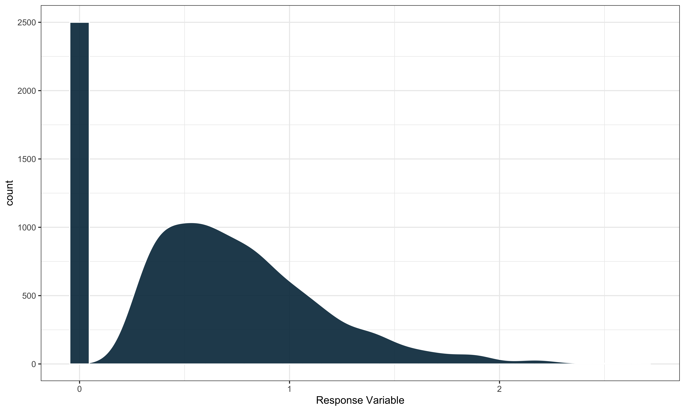

<!-- README.md is generated from README.Rmd. Please edit that file -->

<!-- badges: start -->
[](https://github.com/harvard-ufds/saeczi/actions/workflows/R-CMD-check.yaml)
<!-- badges: end -->

# saeczi

### (Small Area Estimation for Continous Zero Inflated data)

`saeczi` is an R package that implements a small area estimator that
uses a two-stage modeling approach for zero-inflated response variables.
In particular, we are working with variables that follow a
semi-continuous distribution with a mixture of zeroes and positive
continuously distributed values. An example can be seen below:

<!-- -->

`saeczi` first fits a linear mixed model to the non-zero portion of the
response and then a generalized linear mixed model with binomial
response to classify the probability of zero for a given data point. In
estimation these models are each applied to new data points and combined
to compute a final prediction.

The package can also generate MSE estimates using a parametric bootstrap
approach described in Chandra and Sud (2012) either in parallel or
sequentially.

## Installation

You can install the developmental version of `saeczi` from GitHub with:

``` r
# install.packages("pak")
pak::pkg_install("harvard-ufds/saeczi")
```

## Example

We’ll use the internal package datasets to show an example of how to use
`saeczi`.

``` r
library(saeczi)
data(pop)
data(samp)

lin_formula <- DRYBIO_AG_TPA_live_ADJ ~ tcc16 + elev

set.seed(5)
result <- unit_zi(samp_dat = samp,
                  pop_dat = pop, 
                  lin_formula =  DRYBIO_AG_TPA_live_ADJ ~ tcc16 + elev,
                  log_formula = DRYBIO_AG_TPA_live_ADJ ~ tcc16 + elev,
                  domain_level = "COUNTYFIPS",
                  mse_est = TRUE,
                  B = 100,
                  parallel = FALSE)


result$res |> head()
#>   domain       mse      est
#> 1  41001  61.01495 14.85495
#> 2  41003  87.99835 97.74967
#> 3  41005 176.88206 86.02207
#> 4  41007 344.48027 76.24752
#> 5  41009  76.81402 70.28624
#> 6  41011  80.75565 87.65072
```
